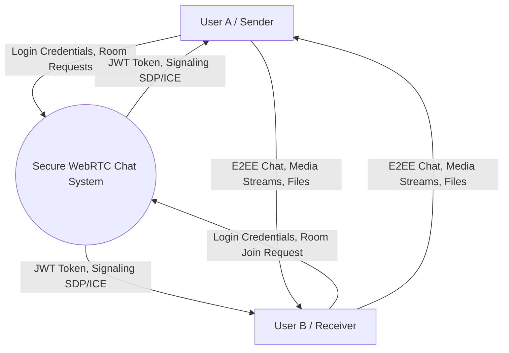
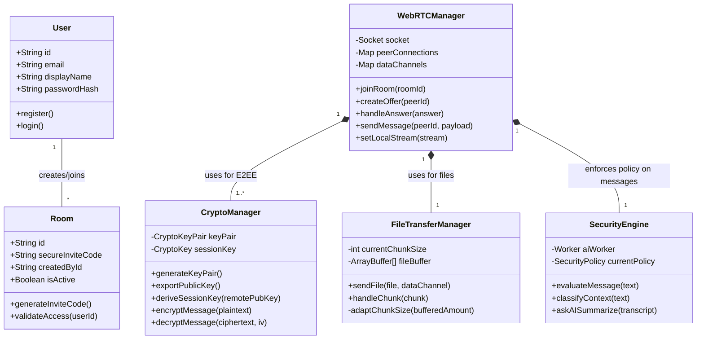

# Project Diagrams: UML and Data Flow

This document contains the formal diagrams requested for the university submission. You can render these diagrams using any Markdown viewer that supports Mermaid.js, or copy the code blocks into [Mermaid Live Editor](https://mermaid.live).

## 1. Use Case Diagram

```mermaid
usecaseDiagram
    actor "User (Student/Professional)" as User
    actor "System Administrator" as Admin

    package "Decentralized Secure Chat System" {
        usecase "Register / Login" as UC1
        usecase "Create Secure Room" as UC2
        usecase "Join Room via Invite" as UC3
        usecase "Send/Receive E2EE Messages" as UC4
        usecase "Initiate Voice/Video Call" as UC5
        usecase "Share Screen" as UC6
        usecase "Transfer Files (Adaptive)" as UC7
        usecase "Generate Chat Summary (Local AI)" as UC8
        usecase "Trigger Security Policy Enforcement" as UC9
    }

    User --> UC1
    User --> UC2
    User --> UC3
    User --> UC4
    User --> UC5
    User --> UC6
    User --> UC7
    User --> UC8

    UC4 ..> UC9 : <<includes>> (Analyzes Context)
```

## 2. Data Flow Diagram (Level 0 - Context Diagram)



## 3. Data Flow Diagram (Level 1)

```mermaid
graph TD
    User[User]
    
    subgraph Client Application
        AuthUI[Authentication UI]
        RoomUI[Room Management UI]
        CommUI[Communication Interface]
        Crypto[Crypto Manager]
        AI[Local AI Security Engine]
    end
    
    subgraph Backend Server
        AuthAPI[Auth REST API]
        RoomAPI[Room REST API]
        SigSock[Socket.IO Signaling]
        DB[(PostgreSQL)]
    end
    
    User -->|Credentials| AuthUI
    AuthUI -->|POST /login| AuthAPI
    AuthAPI -->|Read/Write| DB
    AuthAPI -->|Returns JWT| AuthUI
    
    User -->|Create/Join Request| RoomUI
    RoomUI -->|POST /rooms/create| RoomAPI
    RoomAPI -->|Read/Write| DB
    RoomAPI -->|Returns Invite Code| RoomUI
    
    User -->|Message/File| CommUI
    CommUI -->|Payload| Crypto
    Crypto -->|Classify Context| AI
    AI -->|Returns Policy (e.g. Ephemeral TTL)| Crypto
    Crypto -->|Encrypts (AES-GCM)| CommUI
    CommUI -->|Sends Ciphertext via WebRTC| Receiver[Peer WebRTC Client]
```

## 4. Class Diagram


